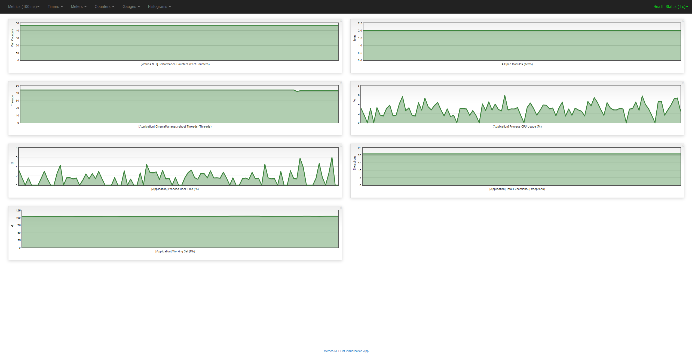

Pascal Lernjournal
==================
Pascal Honegger
Version 1.3, 07.06.2016
:toc:

== 31.05.2016
=== CRC-Karten
Nachdem wir bereits das letzte Mal mit den CRC-Karten gearbeitet haben freute ich mich gar nicht auf ein Wiedersehen. Ich bin der festen Überzeugung, dass das Erstellen eines Klassendiagrammes viel schneller und einfacher ist als das Verwalten der CRC-Karten. Falls man in einem Digital-Tool ein Klassendiagramm erstellt (wie UMLet) und dabei die Verantwortlichkeiten der Klassen integriert kann man die Relationen der Klassen viel einfacher darstellen. Dazu kann man die Karten in einem solchen Tool ohne Probleme erweitern, editieren und entfernen! Das Konzept die Klassen mit den Verantwortlichkeiten niederzuschreiben finde ich nicht schlecht, lediglich die Art und Weise wie die Karten funktionieren finde ich nicht optimal.

=== Module und Filter
Wir waren uns zu Beginn unschlüssig, wie wir die UX optimieren können. Um herauszufinden, wie unsere Applikation verwendet wird, haben wir die Use-Cases umstrukturiert. In diesen geht es nun mehr darum, wie der Kunde sein Ziel erreicht. So kamen wir beim Erstellen der Use-Cases auf die Schlussfolgerung, dass der User im Normalfall die verschiedenen "Module" verbinden möchte. So ist ein Use-Case das filtern / suchen von Vorstellungen. Falls man nun die Vorstellungen anhand eines Filmes suchen möchte, muss man einen Film auswählen können. Wir haben uns dafür entschieden, all diese getrennten Themen in Module aufzuteilen. So haben wir ein Film-Modul und ein Vorstellungs-Modul. In dem Film-Modul kann dann ein Film ausgewählt werden und über einen Knopf gesagt werden, dass das Vorstellungs-Modul über diesen Filter verfügt. Alle Daten, welche geladen werden, werden dann durch diese Filter gesendet und gefiltert. Dies erlaubt das dynamische hinzufügen von Filtern, dazu ist es einfach erweiterbar (Falls neue Filtermöglichkeiten dazukommen) und eine angenehme Herausforderung umzusetzen.
Die Idee ist, dass jedes Modul beim Start seine Filter definieren kann. Auch andere Filtertypen (String und Date) sollten über diesen Konfigurator erstellt werden. Die Darstellung dieser Filter wird auch zentral umgesetzt und kann von jedem Modul verwendet werden.

=== DockingManager
Beim Diskutieren ist die Darstellung der Module ein Thema geworden. Da wir schlussendlich viele Module darstellen müssen, obwohl der Endbenutzer nicht alle benötigt. Wir kamen schnell auf die Schlussfolgerung, dass wir eine Art von Docking verwenden möchten. Der User sollte in der Lage sein, seine Applikation so auszulegen, wie er sie benötigt. Jedes Modul sollte ein Fenster darstellen, welches man mit den anderen Fenstern kombinieren kann.
In der Arbeit verwende ich bereits ein solches Framework und habe daher Erfahrungen, wie ein solches verwendet werden kann. Damit die Applikation wirklich personalisierbar ist, muss das Layout auch beim Neustart noch das selbe sein => Es muss serialisiert werden.

=== Serialisierung => .satan & .satanData
Mithilfe der Serialisierung können wir einfach unsere Daten persistieren. Das heisst, dass sie auf die Festplatte geschrieben und von dort gelesen werden. Zuerst war unser Plan nur die Serialisierung des Layouts, doch mit der Zeit wollten wir noch mehr serialisieren. Unsere Daten wollten wir zuerst auf einem zentralen Server verwalten. Aus Zeitlichen Gründen wollten wir bereits andere Funktionen kürzen, damit dieser zentrale Server Platz hat. Ich kam dabei auf die Idee, einfach jegliche Datenbank wegzulassen und die Daten in Form einer Textdatei auf dem Dateisystem des Benutzers zu speichern. Der Nachteil dabei ist, dass wir eine einzelne Datei mit allen Informationen abspeichern müssten => Man könnte nur sehr erschwert zusammen daran arbeiten (Wer zuletzt kommt überschreibt die Änderungen der Anderen!). Aus Zeitmangel entschieden wir uns dafür, diese Kompromisse einzugehen. Wir möchten zwei Dateiendungen mit unserer Applikation verbinden: 

* .satan speichert das Layout. Die Serialisierung des Layouts übernimmt das Docking-Framework.
* .satanData speichert unsere Daten. Wir möchten die Daten an sich möglichst gut kapseln, dass ein Umstieg auf einen Server mit Datenbank kein grosser Aufwand wäre. Dies sollte auch der Testbarkeit helfen!

== 06.06.2016
=== Filter
Das Filterkonzept ist ein sehr zentrales Konzept unserer Applikation. Zuerst wollte ich ein Visitor-Pattern umsetzen. Als ich mit diesem begonnen habe viel mir aber schnell auf, dass es nicht sehr sinnvoll ist. Wir haben spezifische Datentypen und müssen diese jeweils speziell behandeln. Das neue Konzept erinnert eher an ein Chain-Of-Responsibility, ist aber auch dafür keine exakte Implementation. Schlussendlich ist es eine Elegante Möglichkeit die Filter möglichst zentral zu verwalten. Dies erlaubt es auch, die einzelnen Komponenten besser zu testen.

=== Metrics
Aus reiner Interesse habe ich Metrics in unser Projekt integriert. Zur Integration musste ich lediglich das NuGet-Package installieren und eine Konfiguration bereitstellen. Metrics ist ein Framework welches das Sammeln von Analysedaten erlaubt. Beim Start unsere Applikations im DEBUG-Modus wird eine lokale Website unter dem Port 1235 gehostet. Auf diese Seite kann man diverse Statistiken über die Applikation einsehen. Man kann auch sogenannte Health-Checks definieren und somit sehen, welche Komponenten nicht korrekt funktionieren. Ich habe beispielsweise in einem Graph die Anzahl der geöffneten Module gespeichert. Mithilfe der Graphen kann man dann beispielsweise die geöffneten Module in Relation zu dem Arbeitsspeicherverbrauch analysieren, und eventuelle Memory-Leaks finden.

== 07.06.2016

=== NuGet - DLLs
Man sollte beim Entwickeln nicht immer das Rad neu erfinden. Für viele bekannte Probleme gibt es ein Pattern, womit man das Problem elegant lösen kann. Hat man nun ein grösseres Anliegen wie beispielsweise das oben genannte Docking-GUI müsste man trotzdem sehr viel Code neu schreiben, obwohl andere Entwickler diesen Code bereits geschrieben haben. Eine Lösung für diese Problem sind sogenannte DLLs. Beispiel: Man kann eine DLL eines Docking-Frameworks im Projekt referenzieren. Dadurch kann man auf die Methoden und GUI-Komponenten davon zugreifen. 

Eine bessere Alternative zu den DLLs ist link:https://www.nuget.org/[NuGet]. NuGet ist der bekannteste Package-Manager für C#-Applikationen. Darüber lassen sich anstelle von DLLs sogenannte Packages (Pakete) mit dem Projekt verbinden. Dieses Paket kann auch DLLs beinhalten und unterscheidet sich von der Funktionalität her nicht gross von einer DLL. Der grosse Vorteil dieser Pakete ist, dass NuGet Updates und Abhängigkeiten übernimmt. So kann ein Paket andere Pakete als Abhängigkeit definieren und diese werden automatisch aufgelöst. Dazu bekommt man in Visual Studio benachrichtigungen, wenn ein Paket eine neue Version hat. Auch das Installieren der Pakete ist sehr einfach und direkt in Visual Studio integriert. Es werden auch keine unnötigen Daten in GIT hinterlegt, lediglich ein Eintrag in einer .packages-Datei mit dem Namen des Paketes.